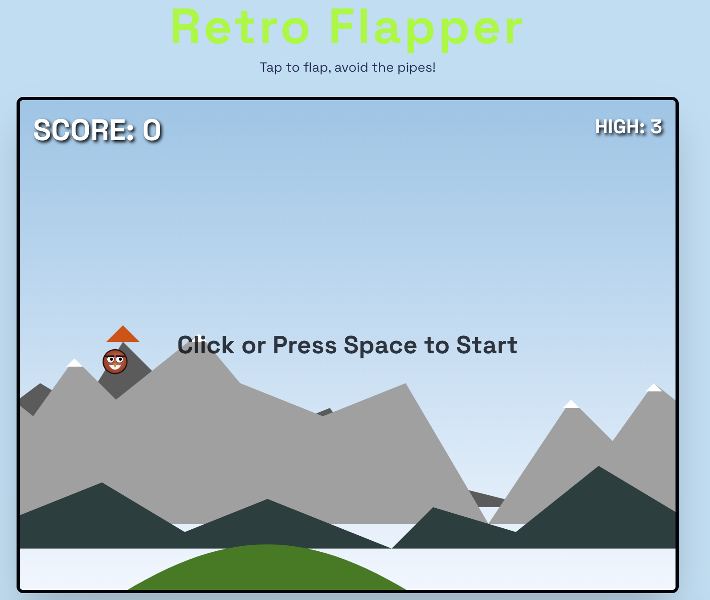
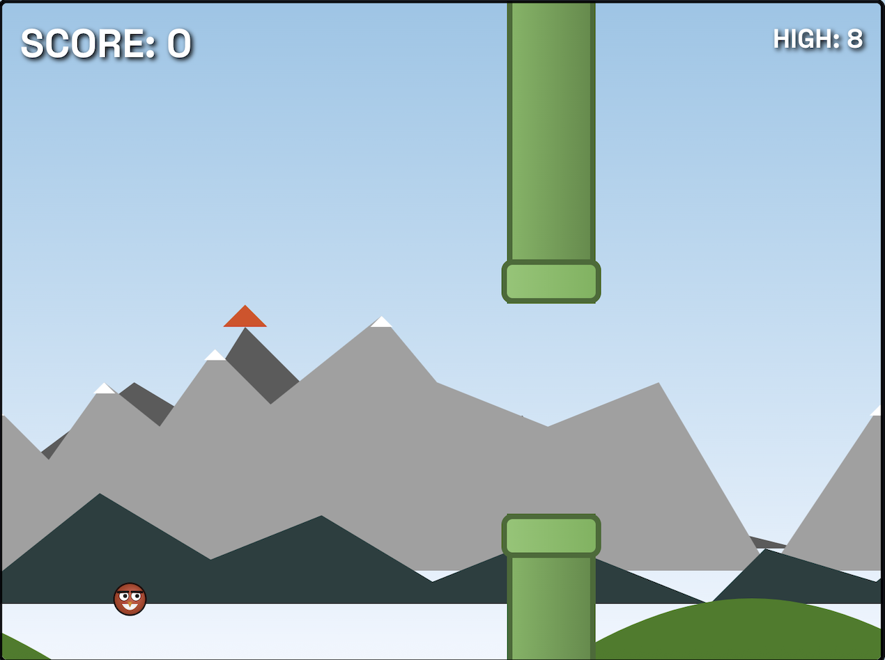
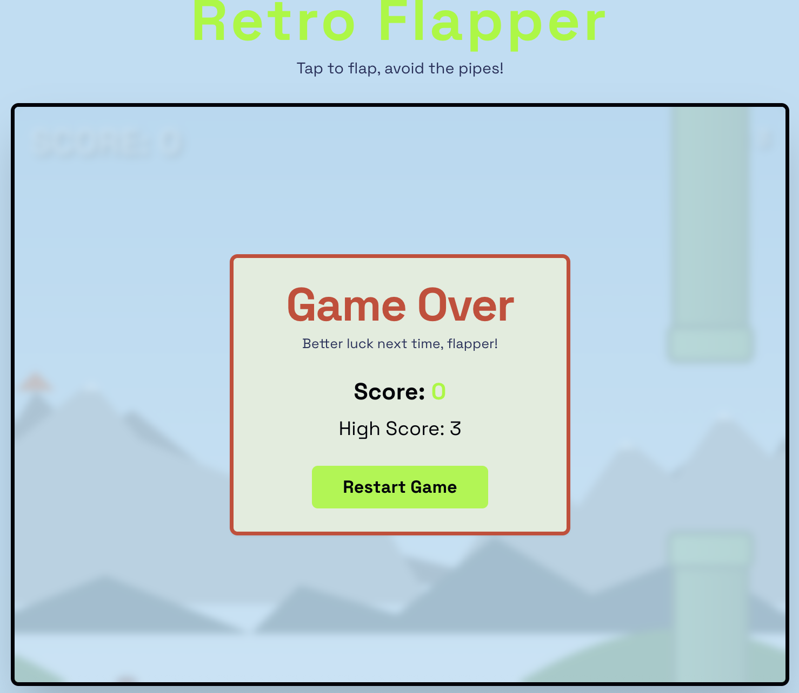

# Retro Flapper
<p align="center">
  
  
    
</p>

*A classic arcade-style flapping game built with modern web technologies.*

**Play the live game here: https://retro-flapper.netlify.app/**

---

## 🚀 About The Project

Retro Flapper is a web-based arcade game inspired by the classic Flappy Bird. The goal is simple: navigate the bird through an endless series of pipes without crashing. The game features progressively increasing difficulty to keep you challenged.

This project demonstrates a fun, interactive web application built with a modern tech stack.

### Key Features

*   **Classic Gameplay:** Simple one-touch (or spacebar) controls.
*   **Progressive Difficulty:** The game speed increases every 30 seconds to test your skills.
*   **Scoring System:** Track your current score and your all-time high score, which is saved in your browser.
*   **Responsive Design:** Playable on both desktop and mobile devices.
*   **Retro Aesthetics:** Styled with a fun, retro-inspired theme.

## 🛠️ Built With

This project is built with the following technologies:

*   [Next.js](https://nextjs.org/) - React Framework for Production
*   [React](https://reactjs.org/) - A JavaScript library for building user interfaces
*   [Tailwind CSS](https://tailwindcss.com/) - A utility-first CSS framework
*   [ShadCN UI](https://ui.shadcn.com/) - Re-usable components built using Radix UI and Tailwind CSS.
*   [TypeScript](https://www.typescriptlang.org/) - Typed JavaScript at scale.

## 🏁 Getting Started

To get a local copy up and running, follow these simple steps.

### Prerequisites

You need to have Node.js and npm installed on your machine.
*   [Node.js](https://nodejs.org/en/) (which includes npm)

### Installation

1.  **Clone the repo**
    ```sh
    git clone https://github.com/AKSA-1/Retro-flapper.git
    ```
2.  **Navigate to the project directory**
    ```sh
    cd Retro-flapper
    ```
3.  **Install NPM packages**
    ```sh
    npm install
    ```
4.  **Run the development server**
    ```sh
    npm run dev
    ```

Open [http://localhost:9002](http://localhost:9002) with your browser to see the result.

## 🚀 Deployment

This Next.js app can be easily deployed to any platform that supports Node.js, such as [Vercel](https://vercel.com/new) or [Netlify](https://www.netlify.com/).

The easiest way to deploy your Next.js app is to use the [Vercel Platform](https://vercel.com/new) from the creators of Next.js. Check out the [Next.js deployment documentation](https://nextjs.org/docs/deployment) for more details.
